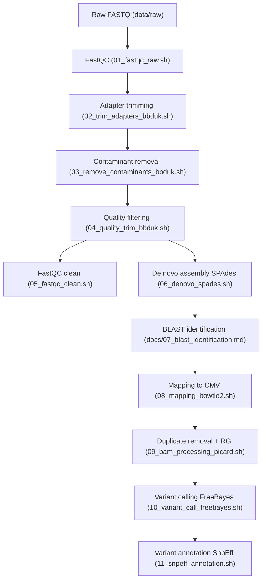

# plant_virus_NGS_denovo_pipeline

A reproducible NGS workflow for identifying plant viruses using de novo assembly and reference-guided mapping. Includes QC, trimming, assembly, BLAST identification, variant calling, and annotation.

This pipeline is adapted from an NGS analysis project completed during my MSc at TUM.  
The original report is not included here, but the full workflow has been rewritten as a standalone, reproducible pipeline.

# Plant virus identification from NGS data (de novo + mapping pipeline)

## Biological question
Given a WGS/RNA-seq library prepared from infected plant tissue:

1. Which virus(es) are present?  
2. What sequence variants do they carry relative to reference genomes?

## Pipeline overview
1. Raw read QC (FastQC)  
2. Adapter trimming (bbduk)  
3. Removal of PhiX / sequencing artifacts (bbduk)  
4. Quality trimming / filtering (bbduk)  
5. Clean read QC (FastQC)  
6. De novo assembly (SPAdes; k-mer optimisation)  
7. Virus identification (blastn vs virus DB)  
8. Reference-guided mapping (bowtie2)  
9. BAM processing + duplicate removal (samtools + Picard)  
10. Variant calling (freebayes)  
11. Variant filtering + annotation (vcffilter + SnpEff)

## Pipeline overview (diagram)



---

## Reference genome
Download the CMV reference genome from NCBI:

https://www.ncbi.nlm.nih.gov/assembly/GCF_000864745.1

Place the FASTA file here:
resources/CMV_ref.fasta

## Assembly parameter optimization

To obtain the best possible de novo assembly of the viral genomes, multiple SPAdes assemblies were performed using different k-mer combinations. Assembly quality was evaluated using contig statistics such as total assembly length, longest contig, and N50 (via BBTools’ `stats.sh` tool).

### Evaluated k-mer sets
Several k-mer configurations were tested, including:

- `25,53,73,93,111`  
- `23,53,83,123`  
- additional intermediate sets explored interactively

Each k-mer set produced its own `contigs.fasta`, which was assessed for:

- assembly continuity (fewer, longer contigs)  
- approximate genome size consistency  
- suitability for BLAST-based virus identification  
- robustness for downstream mapping and variant calling  

### Final choice: `23,53,83,123`
This k-mer set produced:

- the longest, most continuous viral contigs  
- minimal fragmentation  
- strongest BLAST support for viral identity  
- optimal mapping performance for variant calling  

### Reproducible SPAdes command
```bash
spades.py \
  -1 results/qc/quality/infected_clean_R1.fastq.gz \
  -2 results/qc/quality/infected_clean_R2.fastq.gz \
  --only-assembler \
  -t 8 \
  -k 23,53,83,123 \
  -o results/assembly/spades_k23_53_83_123
```

## Main result (original dataset)
De novo contigs and BLAST results identified **Cucumber mosaic virus (CMV)** as the causal infection.  
Mapping confirmed CMV with ~44% alignment rate, and variant calling detected **5 variants across the three viral RNA strands**.

## Reproducibility / data
The course dataset cannot be redistributed.  
To reproduce, substitute any paired-end plant virus dataset and place FASTQ files in `data/raw/`.

## Tools
This pipeline uses the following tools and packages. Please cite them if you use this workflow in academic work.
FastQC, BBTools (bbduk), SPAdes, BLAST, Bowtie2, Samtools, Qualimap, Picard, Freebayes, SnpEff.
Tool versions / parameters are documented in `scripts/`.

This workflow uses common NGS analysis tools. Versions may vary depending on the user's environment; see individual tool documentation for installation and usage details.

### References

**FastQC**  
Andrews S. (2010). *FastQC: A quality control tool for high throughput sequence data.*  
https://www.bioinformatics.babraham.ac.uk/projects/fastqc/

**BBTools / BBDuk / stats.sh**  
Bushnell B. (2014). *BBMap: A Fast, Accurate, Splice-Aware Aligner.*  
https://sourceforge.net/projects/bbmap/

**SPAdes genome assembler**  
Bankevich A. et al. (2012). *SPAdes: A New Genome Assembly Algorithm and Its Applications to Single-Cell Sequencing.* J Comput Biol.  
https://github.com/ablab/spades

**BLAST+**  
Camacho C. et al. (2009). *BLAST+: Architecture and applications.* BMC Bioinformatics 10, 421.

**Bowtie2**  
Langmead B., Salzberg S. (2012). *Fast gapped-read alignment with Bowtie2.* Nat Methods 9, 357–359.  
http://bowtie-bio.sourceforge.net/bowtie2

**Samtools**  
Li H. et al. (2009). *The Sequence Alignment/Map format and SAMtools.* Bioinformatics.  
http://www.htslib.org/

**Picard Toolkit**  
Broad Institute. (2019). *Picard Toolkit.*  
https://broadinstitute.github.io/picard/

**Qualimap**  
García-Alcalde F. et al. (2012). *Qualimap: evaluating next-generation sequencing alignment data.* Bioinformatics.  
http://qualimap.bioinfo.cipf.es/

**FreeBayes**  
Garrison E., Marth G. (2012). *Haplotype-based variant detection from short-read sequencing.*  
arXiv:1207.3907.  
https://github.com/freebayes/freebayes

**vcffilter (vcflib)**  
Garrison E. et al. *vcflib: A C++ library for parsing and manipulating VCF files.*  
https://github.com/vcflib/vcflib

**SnpEff**  
Cingolani P. et al. (2012). *A program for annotating and predicting the effects of SNPs.* Fly (Austin).  
https://pcingola.github.io/SnpEff/


## Disclaimer
This repository contains a reproducible workflow but does not include raw sequencing data or the CMV reference genome. Users must supply their own input FASTQ files and download public reference genomes as described. The workflow is provided “as is” without warranty; verify results independently before use in research or diagnostics.
